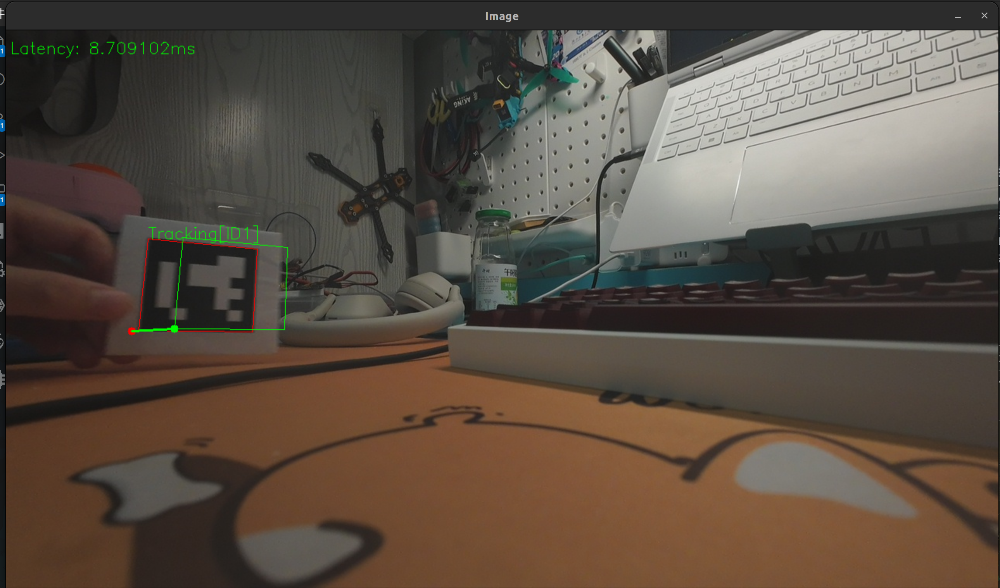
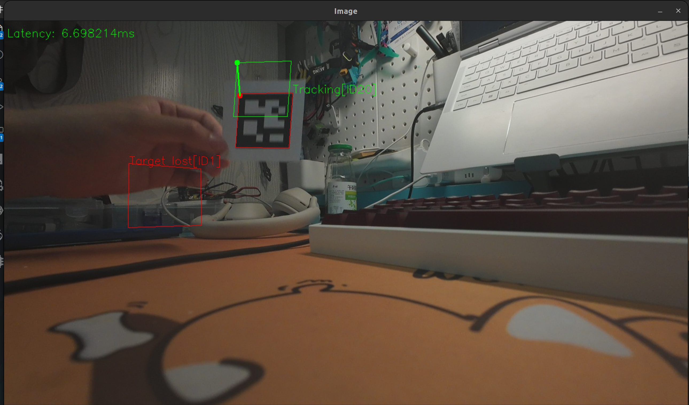

# 🧭 ArUco Marker Detection & EKF Pose Prediction (ROS2)

这是一个基于 **ROS2**、**OpenCV** 和 **Eigen** 的项目，实现了对 **ArUco 标记** 的检测、三维姿态估计，并结合 **扩展卡尔曼滤波（EKF）** 对目标进行状态预测。可用于机器人视觉定位、姿态跟踪与数据融合任务。

---

## 🔧 项目功能

- 使用 OpenCV 的 `aruco` 模块识别摄像头中的 ArUco 标记。
- 通过 `solvePnP` 获取目标在相机坐标系中的位置与姿态。
- 使用 ROS2 的 TF2 广播坐标变换。
- 发布目标位姿为 `geometry_msgs::msg::PoseStamped`。
- 实现扩展卡尔曼滤波器，对位姿数据进行平滑预测。
- 可视化检测结果和滤波轨迹。

---

## 🚀 使用方法

### 1. 环境依赖

- ROS 2 Humble
- OpenCV >= 4.5（建议 4.10.0）
- Eigen3
- dji_camera_sdk(已经包含在本项目中)

建议使用 `colcon` 编译。

### 2. 安装依赖

```bash
sudo apt update
sudo apt install ros-${ROS_DISTRO}-cv-bridge ros-${ROS_DISTRO}-image-transport \
                 ros-${ROS_DISTRO}-tf2 ros-${ROS_DISTRO}-tf2-ros \
                 libeigen3-dev
```
### 3. 编译项目
```bash
cd ~/ros2_ws/src
git clone https://github.com/your_username/aruco_ekf.git
cd ..
colcon build
source install/setup.bash
```

### 4. 运行节点
```bash
ros2 run ArUco ArUco
```

## 
## 📦 消息接口

### 发布话题

| Topic 名称      | 消息类型                          | 描述                    |
|------------------|-----------------------------------|-------------------------|
| `/aruco_pose`    | `geometry_msgs::msg::PoseStamped` | ArUco 标记的位置与姿态 |
| `/filtered_pose` | `geometry_msgs::msg::PoseStamped` | EKF 预测后的位置与姿态 |

### 坐标变换（TF）

| 父坐标系 (`frame_id`) | 子坐标系 (`child_frame_id`) | 描述              |
|------------------------|------------------------------|-------------------|
| `camera_frame`         | `aruco_marker`               | ArUco 检测位姿     |
| `camera_frame`         | `aruco_filtered`             | EKF 预测位姿       |

##
## 📷 示例效果


